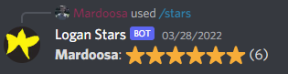
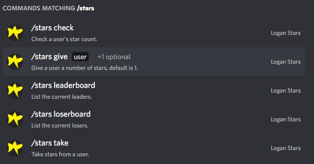

# logan-stars-bot

Discord bot to track a user's star count.

## Commands

This bot uses discord's [application commands](https://discord.com/developers/docs/interactions/application-commands), which allows for command hints and auto-completion. When you start typing `/stars`, you should be able to see and interact with the following prompt.

Anyone can use the following commands:

- `/stars check (user: optional, default is the person who calls this)`
- `/stars leaderboard (number of users to list: optional, default 3)`
- `/stars loserboard (number of users to list: optional, default 3)`

Users with the guild role "Admin" can do:

- `/stars give (user: required) (number of stars: optional, default 1)`
- `/stars take (user: required) (number of stars: optional, default 1`

## Implementation Details
- [AWS DynamoDB](https://aws.amazon.com/dynamodb/) for backend storage. NoSQL database with `userId` as the primary key and `guildId` as the sort key.
- [AWS Elastic Beanstalk](https://aws.amazon.com/elasticbeanstalk/) for hosting.

Do `npm run dev` for local debugging

